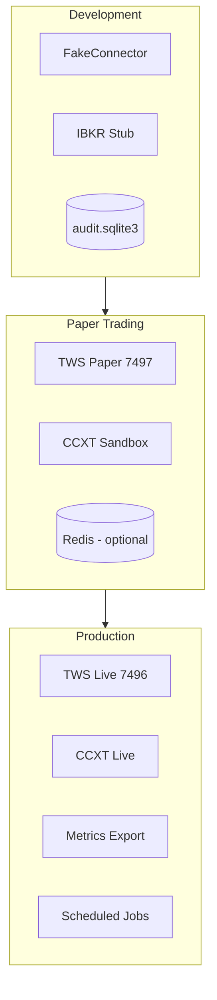
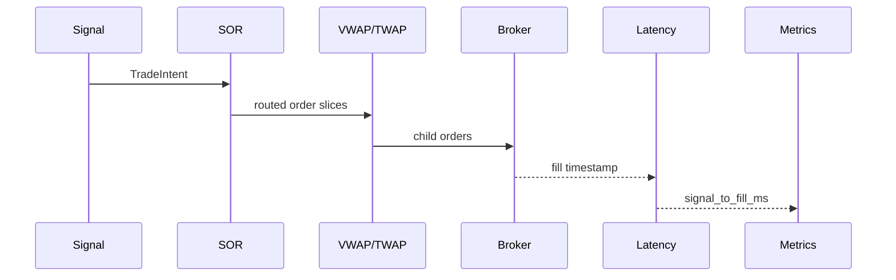
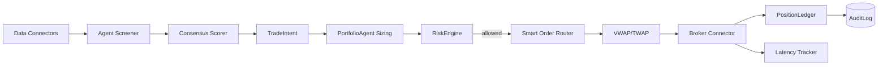

# Crosspoint Platform Architecture

This document describes the **target environment architecture** and how the seven capability gaps identified in the README assessment map to concrete modules in this repository.

## Design Principles

1. **Two-layer architecture** — `global_trading` owns execution, risk gates, audit, and backtesting; `fincept_terminal` owns analytics, AI agents, data connectors, and the Qt UI.
2. **Paper-first rollout** — All live paths require explicit env flags (`GTP_PAPER_FIRST`, broker API keys).
3. **Audit everything** — Every intent, risk decision, and fill is logged to SQLite (`GTP_AUDIT_DB_PATH`).
4. **Composable pipelines** — Visual workflows, CLI screening, and `TradingWorkflow` share the same node types.

---

## Environment Tiers



| Tier | Purpose | Key env vars | Connectors |
|------|---------|--------------|------------|
| **Dev** | Local dev, CI, unit tests | `GTP_IBKR_USE_STUB=1`, `GTP_KILL_SWITCH=false` | `FakeConnector` |
| **Paper** | Strategy validation before capital | `GTP_PAPER_FIRST=true`, `GTP_IBKR_PORT=7497` | IBKR paper, CCXT sandbox |
| **Prod** | Live capital deployment | `GTP_KILL_SWITCH` monitored, `GTP_MAX_DAILY_LOSS_BASE` enforced | IBKR live, CCXT live |

### Docker Compose Services

```yaml
# docker-compose.yml (see repo root)
services:
  crosspoint-api    # FastAPI health + workflow trigger (future)
  crosspoint-worker # Celery: scheduled screening, consensus runs
  redis             # Job queue + result cache
  # External: TWS/IB Gateway runs on host, not in container
```

IBKR TWS/Gateway must run on the host machine (or a dedicated VM) because it requires GUI/session auth. The platform connects via `GTP_IBKR_HOST` / `GTP_IBKR_PORT`.

---

## Module Map: Gaps → Implementation

### 1. Execution Quality

| Component | Module | Status |
|-----------|--------|--------|
| Smart Order Routing | `global_trading/execution/sor.py` | Implemented — score brokers by latency, fill rate, cost |
| Slippage model | `global_trading/execution/slippage.py` | Implemented — linear + sqrt market impact |
| VWAP / TWAP | `global_trading/execution/algorithms.py` | Implemented — slice scheduler |
| Latency monitoring | `global_trading/execution/latency.py` | Implemented — signal→fill histogram in `Metrics` |
| Execution benchmarking | `global_trading/execution/benchmark.py` | Implemented — arrival price vs fill |

**Data flow:**



### 2. AI Agent Orchestration

| Component | Module |
|-----------|--------|
| Multi-ticker screening | `fincept_terminal/agents/orchestration/screener.py` |
| Consensus scoring | `fincept_terminal/agents/orchestration/consensus.py` |
| Scheduled runs | `fincept_terminal/scheduler/tasks.py` (Celery stub) |

**Consensus algorithm:** Each agent returns `AgentResult` with `recommendation` and `confidence`. Scores map to numeric values (STRONG_BUY=2, BUY=1, HOLD=0, SELL=-1, STRONG_SELL=-2). Weighted average across agents; threshold ≥ 1.0 = consensus BUY.

**CLI:**

```bash
fincept screen --watchlist AAPL,MSFT,NVDA --min-consensus 0.5
fincept consensus --ticker AAPL
```

### 3. Visual Workflow Editor

| Component | Module |
|-----------|--------|
| JSON schema | `fincept_terminal/workflows/schema.py` |
| DAG executor | `fincept_terminal/workflows/executor.py` |
| Example workflows | `examples/workflows/*.json` |
| Qt integration | `node_editor.py` → calls `WorkflowExecutor` |

**Node types:** `data/*`, `analytics/*`, `agent/*`, `trading/*`, `output/*`

Example: `examples/workflows/agent-screening.json` — Yahoo → Buffett+Graham+Lynch+Dunlap → Consensus → Alert.

### 4. Risk Management Integration

| Component | Module |
|-----------|--------|
| Kill switch + daily loss | `global_trading/core/risk.py` (existing) |
| Max drawdown enforcement | `RiskConfig.max_drawdown_pct` (new) |
| VaR-based position sizing | `global_trading/agents/portfolio.py` (new) |
| Real-time risk feed | `PortfolioAgent` reads `RiskState.peak_equity` |

**Sizing formula:** `qty = (portfolio_value × var_fraction) / (price × VaR_95)`

### 5. ML / AI Quant Lab

| Status | Notes |
|--------|-------|
| **Partial** | `quantlib/pricing.py`, `quantlib/risk.py` are real |
| **Stub** | Missing volatility/stochastic/fixed_income/derivatives modules — imports fixed to avoid breakage |
| **Planned** | Factor discovery pipeline on top of `analytics/risk.factor_exposure()` |

Quant Lab is **not** HFT-ready. True HFT requires co-located tick data, sub-ms infra, and FPGA/custom gateways — out of scope for this repo's architecture.

### 6. Data Connectors

| Connector | Production-ready | Notes |
|-----------|------------------|-------|
| Yahoo Finance | Yes | Primary equity OHLCV + fundamentals |
| FRED | Partial | Needs `FRED_API_KEY` for macro series |
| Kraken | Partial | REST + WS; keys for trading |
| Polygon | Stub | `polygon.py` — requires `POLYGON_API_KEY` |
| IBKR / CCXT | Partial | Via `global_trading/connectors/` |

**Macro → agents:** FRED GDP/CPI series can be injected into agent `analyze()` via `additional_data` in future workflow nodes (`data/fred` → `agent/buffett`).

### 7. Backtesting

| Component | Module |
|-----------|--------|
| Historical replay | `global_trading/backtest/engine.py` |
| Data loader | `global_trading/backtest/data.py` |
| Metrics | Sharpe, max drawdown, win rate, total return |

**CLI:**

```bash
fincept backtest --ticker SPY --strategy buy_hold --start 2020-01-01 --end 2024-12-31
crosspoint backtest --watchlist AAPL,MSFT --strategy agent_consensus
```

Backtests replay bars through a strategy function, simulate fills with the slippage model, and update `PositionLedger`.

---

## Unified Trading Pipeline



---

## Configuration Reference

Copy `config/compliance.example.env` to `.env` at repo root.

| Variable | Purpose |
|----------|---------|
| `GTP_KILL_SWITCH` | Emergency halt — no orders pass risk |
| `GTP_MAX_DAILY_LOSS_BASE` | Daily loss limit in USD |
| `GTP_PAPER_FIRST` | Require paper/sandbox before live |
| `GTP_IBKR_USE_STUB` | Use simulated IBKR (dev/CI) |
| `GTP_AUDIT_DB_PATH` | SQLite audit trail |
| `FRED_API_KEY` | FRED macro data |
| `POLYGON_API_KEY` | Polygon market data (stub connector) |

---

## Implementation Roadmap

| Phase | Deliverable | Dependency |
|-------|-------------|------------|
| **1** (done) | Fix broken imports, consensus, backtest, execution quality modules | — |
| **2** | Wire `WorkflowExecutor` to Qt `Run Workflow` button | Phase 1 |
| **3** | Connect `PortfolioAgent` VaR sizing to live `RiskMetrics` | Phase 1 |
| **4** | Celery worker for nightly watchlist screening | Redis + Phase 1 |
| **5** | Prometheus exporter for `Metrics` + latency histograms | Phase 1 |
| **6** | Factor discovery pipeline (Quant Lab) | Phase 3 |
| **7** | Full broker implementations (Alpaca, Polygon live) | Paper validation |

---

## Testing Strategy

```bash
pytest tests/                    # Unit tests
fincept backtest --ticker SPY    # Integration smoke
fincept screen --watchlist AAPL  # Agent pipeline smoke
crosspoint run-once              # End-to-end workflow (fake connector)
```

CI runs `scripts/verify.ps1` / `verify.sh`: pytest + `run-once` + `reconcile`.
